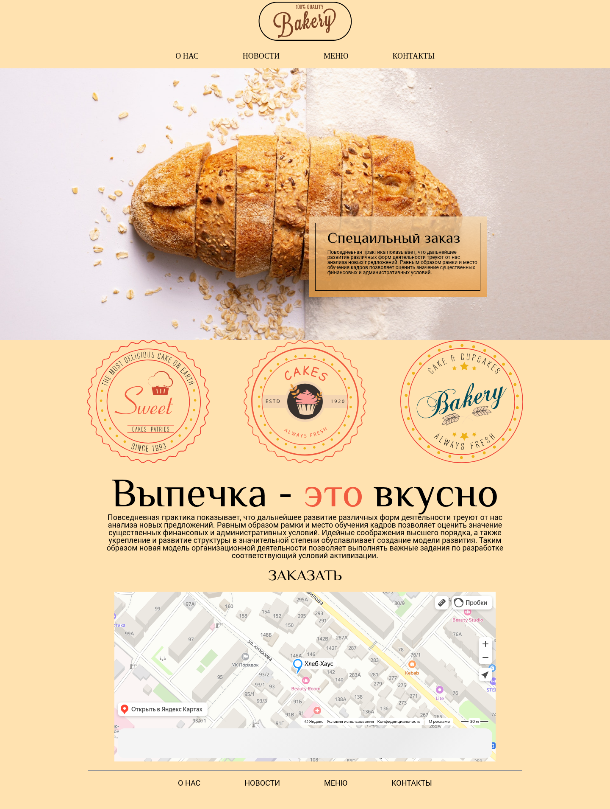

# Bakery — лендинг магазина выпечки

Мой самый первый проект: одностраничный сайт пекарни, свёрстанный на чистом HTML и CSS — без JavaScript, фреймворков и сборщиков. Проект учебный: на нём я отрабатывал базовые навыки вёрстки и впервые прошёл путь от макета до публикации репозитория на GitHub.



## Демо

https://github.com/GGadjiev/Bakery

## Цель проекта

Закрепить теоретические знания HTML и CSS на практике: сверстать страницу по готовому макету, повторив его структуру и оформление. Попутно разобраться в семантической разметке, подключении шрифтов и работе блочной модели. Отдельная цель — пройти полный цикл работы над проектом: от пустой папки до опубликованного репозитория с описанием.

## Что на странице

Лендинг собран из классических блоков:

- **Шапка** — логотип Bakery и горизонтальное меню: «О нас», «Новости», «Меню», «Контакты».
- **Hero-блок** — фоновая фотография свежего хлеба, поверх которой справа расположена карточка «Специальный заказ» с градиентной рамкой.
- **Блок с эмблемами** — три винтажные круглые печати с символикой пекарни.
- **Призыв к действию** — крупный заголовок «Выпечка — это вкусно» (слово «это» выделено красным), описание и кнопка «Заказать».
- **Карта** — интерактивная Яндекс.Карта с меткой пекарни, встроенная через iframe.
- **Футер** — разделительная линия и повтор навигационного меню.

## Технологии

- **HTML5** — семантические теги `<header>`, `<nav>`, `<main>`, `<section>`, `<footer>`.
- **CSS3**:
    - `@font-face` — локальное подключение шрифтов **Philosopher** (заголовки) и **Roboto** (основной текст) в трёх форматах: `.woff`, `.ttf`, `.eot`;
    - **Flexbox** — центрирование карточки «Специальный заказ» внутри градиентной рамки;
    - **позиционирование** — наложение карточки на фоновое фото через смещение `left` / `top`;
    - `linear-gradient` — градиентная рамка: градиентный фон у внешнего блока и внутренний блок с отступом;
    - `background: center / cover` — фоновое фото hero-блока без искажений;
    - `box-sizing: border-box` — предсказуемые размеры блоков.
- **reset.css + normalize.css** — приведение дефолтных стилей браузеров к единому виду.
- **SVG** — логотип и эмблемы.
- **iframe** — встраивание Яндекс.Карты.

## Структура проекта

```
Bakery/
├── src/
│   ├── index.html          # разметка страницы
│   ├── css/
│   │   ├── reset.css       # сброс стилей
│   │   ├── normalize.css   # нормализация стилей браузеров
│   │   └── style.css       # основные стили проекта
│   ├── fonts/              # шрифты Philosopher и Roboto (eot, ttf, woff)
│   ├── icons/              # SVG: логотип и три эмблемы
│   └── img/                # фоновое фото хлеба для hero-блока
├── screenshots/
│   └── landing.png         # скриншот для README
├── .gitignore
└── README.md
```

## Как запустить

Проект не требует установки зависимостей и сборки — это статическая страница.

1. Склонируйте репозиторий (или скачайте ZIP-архив и распакуйте его):

   ```bash
   git clone https://github.com/GGadjiev/Bakery.git
   ```

2. Откройте файл `src/index.html` в любом современном браузере.

Единственный внешний элемент на странице — Яндекс.Карта: она подгрузится при наличии интернета. Шрифты, иконки и фотография хранятся локально, поэтому остальная часть страницы работает и офлайн.

## Чему я научился

- Верстать страницу по макету и переносить дизайн в код без сторонних библиотек.
- Организовывать файловую структуру: стили, шрифты и графика разложены по отдельным папкам.
- Подключать локальные шрифты через `@font-face` и понимать, зачем нужны разные форматы файлов.
- Использовать Flexbox и позиционирование, чтобы накладывать элементы друг на друга.
- Собирать декоративные эффекты чистым CSS: градиентная рамка карточки сделана без единой картинки.
- Встраивать сторонний виджет — Яндекс.Карту — через iframe.
- Работать с Git: вести историю коммитов и публиковать проект на GitHub.

## Текущее состояние

- **Десктоп-версия.** Страница свёрстана под экраны шириной около 1440px, размеры блоков заданы фиксированно. Адаптивность — цель следующего этапа обучения.
- **Ссылки-заглушки.** Пункты меню и кнопка «Заказать» пока никуда не ведут — интерактив появится вместе с изучением JavaScript.
- **Код первого опыта.** Стили местами можно упростить — например, оставить либо reset, либо normalize. Я знаю об этом и вернусь к проекту по мере роста навыков.